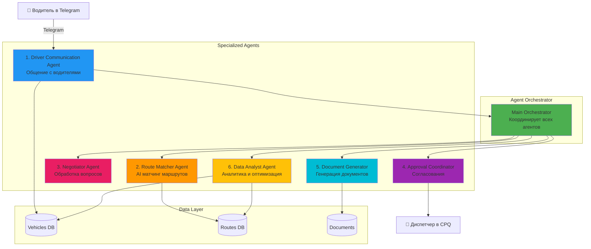
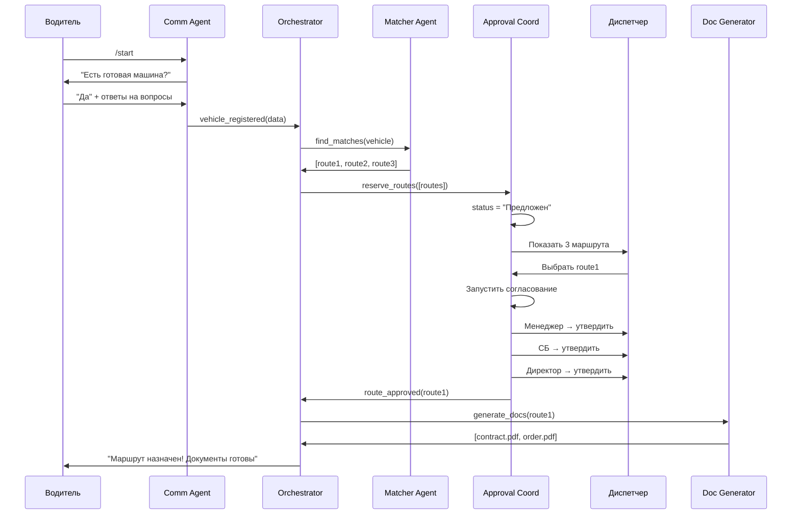

# Multi-Agent Logistics Dispatch System - Architecture

## Обзор системы

Система из **6 специализированных AI-агентов** + **оркестратор** для автоматизации поиска и распределения транспорта.



---

## Агенты и их роли

### 1. **Driver Communication Agent** 🚛
**Роль:** Сбор данных о свободных машинах

**Функции:**
- Ведёт диалог с водителем (как психолог/детектив)
- Собирает 10 параметров машины
- Обрабатывает отклонения от сценария
- Эскалирует сложные вопросы к Negotiator Agent

**Технологии:**
- Telegram Bot (aiogram)
- LLM для естественного диалога
- FSM для управления состояниями

**Промпт:**
```
Ты - дружелюбный помощник диспетчерской службы.
Твоя задача - собрать информацию о свободной машине.
Будь деликатным, поддерживай беседу, но получи все ответы.
```

---

### 2. **Route Matcher Agent** 🎯
**Роль:** Умный поиск подходящих маршрутов

**Функции:**
- Анализирует параметры машины
- Ищет в базе подходящие заявки
- Применяет AI для ранжирования по выгодности
- Предлагает ТОП-3 маршрута
- Ставит временную бронь

**AI Logic:**
```python
# Критерии матчинга с весами
matching_score = (
    location_match * 0.30 +      # Совпадение локации
    destination_match * 0.25 +   # Совпадение назначения
    vehicle_type_match * 0.20 +  # Тип ТС
    capacity_match * 0.15 +       # Грузоподъемность
    profitability * 0.10         # Выгодность
)
```

**Промпт:**
```
Ты - эксперт по логистике с 15-летним опытом.
Проанализируй параметры машины и найди 3 самых подходящих маршрута.
Учитывай: расстояние, выгодность, срочность, тип груза.
Объясни почему выбрал именно эти маршруты.
```

---

### 3. **Negotiator Agent** 💬
**Роль:** Обработка нестандартных ситуаций

**Функции:**
- Отвечает на вопросы водителя ("Сколько заплатят?")
- Разруливает конфликты
- Возвращает к основному сценарию
- Эскалирует к живому менеджеру при необходимости

**Промпт:**
```
Ты - senior менеджер по работе с водителями.
Задача: деликатно ответить на вопрос и вернуть к регистрации.
Если вопрос сложный (цена, условия) - предложи связаться с менеджером.
Будь эмпатичным но настойчивым.
```

**Примеры:**
- Водитель: "А сколько заплатят?"
  → Negotiator: "Отличный вопрос! Оплата зависит от маршрута. Давайте сначала зарегистрируем машину, а потом менеджер обсудит с вами конкретные условия. Договорились?"

---

### 4. **Approval Coordinator Agent** ✅
**Роль:** Управление процессом согласования

**Функции:**
- Запускает workflow согласования (менеджер → СБ → директор)
- Отслеживает статусы
- Напоминает о просроченных согласованиях
- Управляет брон ями маршрутов
- Снимает бронь при таймауте

**State Machine:**
```
Предложен → Согласование (Менеджер) →
Согласование (СБ) → Согласование (Директор) →
Утверждён / Отклонён
```

---

### 5. **Document Generator Agent** 📄
**Роль:** Автоматическая генерация документов

**Функции:**
- Генерирует договоры
- Создаёт заказ-наряды
- Формирует акты выполненных работ
- Заполняет шаблоны данными из базы

**Технологии:**
- LLM для заполнения шаблонов
- PDF generation
- Интеграция с СЭД

**Промпт:**
```
Заполни шаблон договора на перевозку.
Данные:
- Водитель: {driver_name}
- Маршрут: {from_location} → {to_location}
- Груз: {cargo_type}, {weight} тонн
- Стоимость: {price} руб.

Проверь корректность всех данных и юридическую правильность формулировок.
```

---

### 6. **Data Analyst Agent** 📊
**Роль:** Аналитика и оптимизация

**Функции:**
- Анализирует эффективность матчинга
- Выявляет паттерны (какие маршруты популярны)
- Предсказывает спрос на транспорт
- Оптимизирует алгоритмы матчинга
- Генерирует отчёты для менеджмента

**Метрики:**
- % успешных матчингов
- Среднее время на регистрацию
- Топ водителей/маршрутов
- Конверсия "предложен → утверждён"

---

## Orchestrator - Мозг системы

```python
class DispatchOrchestrator:
    """Координирует работу всех агентов"""

    async def handle_new_vehicle(self, vehicle_data):
        # 1. Собрали данные через Communication Agent
        # 2. Запускаем Route Matcher
        routes = await self.route_matcher.find_matches(vehicle_data)

        # 3. Бронируем маршруты
        await self.approval_coordinator.reserve_routes(routes)

        # 4. Отправляем диспетчеру
        await self.approval_coordinator.send_for_approval(routes)

        # 5. Логируем для аналитики
        await self.data_analyst.log_event("vehicle_registered", vehicle_data)

    async def handle_route_approved(self, route_id):
        # 1. Снимаем бронь с других
        await self.approval_coordinator.release_other_routes(route_id)

        # 2. Генерируем документы
        docs = await self.document_generator.generate_documents(route_id)

        # 3. Обновляем аналитику
        await self.data_analyst.log_event("route_confirmed", route_id)
```

---

## MCP Integration Points

### MCP Server 1: Route Database
```python
# Агенты могут запрашивать данные о маршрутах
@mcp_tool
def search_routes(location, destination, vehicle_type):
    """Поиск маршрутов в базе"""
    return db.query(...)

@mcp_tool
def reserve_route(route_id, vehicle_id, timeout_minutes=30):
    """Временная бронь маршрута"""
    return booking_service.reserve(...)
```

### MCP Server 2: Document Templates
```python
@mcp_tool
def get_contract_template(contract_type):
    """Получить шаблон договора"""
    return templates.load(...)

@mcp_tool
def fill_template(template_id, data):
    """Заполнить шаблон данными"""
    return template_engine.render(...)
```

### MCP Server 3: Analytics
```python
@mcp_tool
def get_matching_stats():
    """Статистика матчинга"""
    return analytics.get_stats()

@mcp_tool
def predict_demand(date_range):
    """Предсказание спроса"""
    return ml_model.predict(...)
```

---

## Workflow: Полный цикл



---

## Преимущества Multi-Agent подхода

| Аспект | Single-Agent | Multi-Agent |
|--------|-------------|-------------|
| **Специализация** | ❌ Один делает всё | ✅ Каждый эксперт в своей области |
| **Масштабируемость** | ❌ Сложно расширять | ✅ Добавляем новых агентов |
| **Параллелизм** | ❌ Последовательно | ✅ Агенты работают параллельно |
| **Отказоустойчивость** | ❌ Упал = всё упало | ✅ Отказ агента изолирован |
| **Обучаемость** | ❌ Переучиваем всё | ✅ Улучшаем отдельных агентов |

---

## Развитие системы (Roadmap)

### Phase 1 (MVP) - Текущий
- ✅ Driver Communication Agent
- ✅ Базовый матчинг
- ✅ Ручное согласование

### Phase 2 (Pilot)
- 🚀 Route Matcher Agent с AI
- 🚀 Approval Coordinator
- 🚀 Document Generator
- 🚀 Интеграция с CPQ

### Phase 3 (Production)
- 🔮 Negotiator Agent
- 🔮 Data Analyst Agent
- 🔮 Автоматическое согласование (без диспетчера)
- 🔮 Voice AI для обзвона

### Phase 4 (AI-First)
- 🔮 Полностью autonomous dispatch
- 🔮 Predictive analytics
- 🔮 Market intelligence (мониторинг конкурентов)
- 🔮 Dynamic pricing

